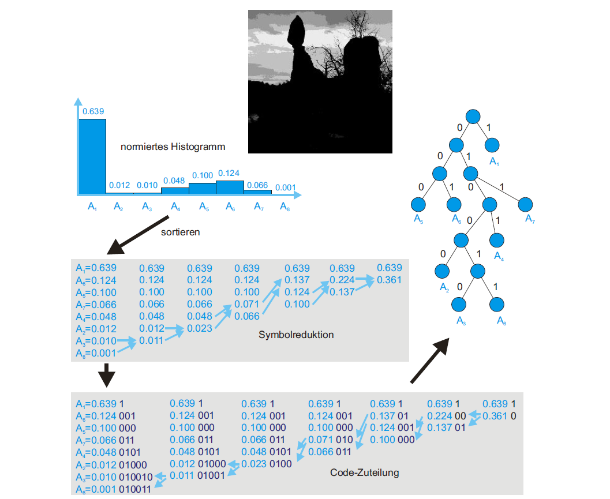
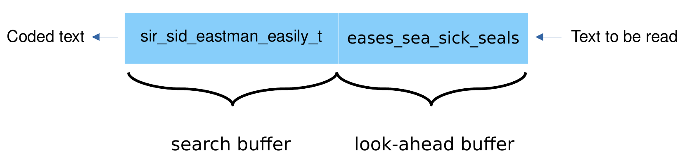

+++
title = "Lossless Data Compression"
date = "2022-05-24"
authors = ["yolanda.thiel"]
tags = ["Teaching", "EPEA 2021"]
+++

This post is an introduction to lossless data compression in which we will explore the approaches of entropy-based/statistical as well as dictionary-based compression and explain some of the most common algorithms.

<!--more-->

## But first of all, why do we even need data compression?

Audio and video communication as well as large multimedia platforms as we know them today are only possible because of data compression.
Usually, every single photo or video posted on social media or video/streaming platforms has to be compressed.
Otherwise, the size of the data would be too large to deal with effectively.
Of course, in scientific research, there are also fields of application where we generate or measure large amounts of data.
To store all this data, we need data compression.

## Basics

A data compression technique usually contains two algorithms:
1. One compression algorithm which takes the original input A and generates a representation of this original input A' which (ideally) requires less bits than A.
2. One reconstruction/decoding algorithm which operates on the compressed representation A' and generates the reconstruction B.

If B is identical to A, the compression is called lossless.
If B differs from A, the compression is called lossy.
To compare different compression algorithms it is possible to use the data compression ratio which can be calculated by dividing the uncompressed size by the compressed size of the data.

\text{data compression ratio} = \frac{\text{uncompressed size of data}}{\text{compressed size of data}} = \frac{\text{size of A}}{\text{size of A'}}

Of course, this is only one of different useful measurements and the performance of compression algorithms is highly dependent on the input data.
But if there are several algorithms that are suitable for the data which is to be compressed, comparing the compression ratio could be sensible.[^1]

## A first compression algorithm: Run-Length Encoding (RLE)

Let us have a look at this rather easy compression algorithm, called **run-length encoding**:
It stores **runs** of data as single data value and count.
A **run** is a sequence in which the same data value occurs in consecutive data elements.

Let's consider a line of 10 pixels, where the pixels can either be white or black.
If W stands for a white pixel and B for a  black pixel, we could have data which looks like this: `BBBBBWWWWW`.
A run-length encoding algorithm could compress this input as following `5B5W`, because there are 5 black pixels followed by 5 white pixels.
So instead of saving 10 characters, the output of RLE would only need 4 characters.

*Of course, we do not need to use chars but also could use other data types to save and compress our data. We use chars in this example because this should make it easier to understand the concept.*

This approach works best if there are many longer runs in the data.
Therefore, the best case scenario of the input for our example would be `WWWWWWWWWW` or `BBBBBBBBBB`, because this input can be compressed as `10W` or `10B`, which is the shortest possible output for this example.
In this case we would have a compression ratio of \frac{10}{3} = 3.\overline{3}(also sometimes displayed as 10:3).

But if there aren't many runs in the file, which is to be compressed, the output file of the algorithm might be larger than the input file.
In the case of our example the worst case would be one of these input files: `WBWBWBWBWB` `BWBWBWBWBW`.[^2]

---

What would be the compression rate in this worst case? <i>Click to show the answer.</i>

0.5, because the uncompressed size is 10 chars and the 'compressed' size is 20 chars.

---

## Entropy-based/statistical compression

The next approaches, we want to get to know, are called entropy-based because they use the entropy of the given data.
The entropy of data depends on the probabilities of certain symbols to occur in the given data.[^3]
While Run-Length Encoding assigns a fixed-size code to the symbols it operates on, entropy-based approaches have variable-sized codes.
Entropy-based approaches work by replacing unique symbols within the input data with a unique and shorter prefix code.[^4]
To ensure a good compression ratio, the used prefix should be shorter the more often a symbol occurs.[^4] [^5]
Examples of this approach are arithmetic coding, Shannon-Fano coding and Huffman coding.

### Huffman coding

We will explore some of the previously mentioned properties of entropy-based compression algorithms on the example of Huffman coding.

  <figure>
    
    <figcaption>This example is taken from page 136 of Tönnies' book "Grundlagen der Bildverarbeitung".6</figcaption>
  </figure>

In this example we want to compress the image shown on the top.
To do so, we create a normed histogram of all values as the first step.
In the image itself but also in its histogram we can see that the darkest possible greyscale value occurs quite often while the other lighter greyscale values have lower frequencies.
The algorithm now merges the symbols according to their frequency until there are only 2 symbols left.
So in the case of the example, the two least frequent greyscale values are merged in every step.
Then the original symbols are given new prefix codes.
Symbols which were previously merged are broken down into segments and for every segment the code is extended.
Therefore, the most occuring symbol gets the shortest prefix code and the least occuring symbol gets the longest prefix code.
The prefix code assignment is represented in a binary tree, which is also traversed to decode the information.[^6]
This approach produces the best code when the probabilities of symbols are negative powers of 2.[^3]

## Dictionary-based compression

Dictionary-based approaches are the last group of lossless data compression algorithms we will cover in this article.
Unlike entropy-based approaches, dictionary-based ones do **not** use a statistical model or a variable-sized code.[^3]

Dictionary-based algorithms partition the data into phrases which are non-overlapping subsets of the original data.[^4]
Each phrase is then encoded as a token using a dictionary.[^3]
Accordingly, there are two stages in a dictionary-based compression algorithm:
1. The dictionary construction stage: In this stage the algorithm finds phrases and codewords.
2. The parsing stage: In this stage the phrases are replaced by codewords.[^7]

There are **static dictionary codes** and **dynamic/adaptive dictionary codes**.
**Static** dictionaries are created before the input processing and stay the same for the complete run, while **dynamic** dictionaries are updated during parsing which means that in this case the two stages (dictionary construction and parsing) are interleaved.[^4]
After these rather theoretical basics about dictionary-based compression, we will now dive into different LZ-family algorithms to explain these things on a few examples.

### LZ family

These algorithms are named after their creators Abraham Lempel and Jacob Ziv and are some of the most known dictionary compression methods.[^4]
The algorithms we will go into detail about are LZ77 and LZ78, which are the two original algorithms developed by Lempel and Ziv, as well as a few of their variants.

### LZ77 and its variants

LZ77 assumes and exploits that data is most likely to be repeated.[^4]
The principle is to use a part of the previously-seen input stream as the dictionary.
Thus the input is analyzed through a sliding window:

  <figure>
    
    <figcaption>This example is taken from page 176 of Salomon's book "Data Compression: The Complete Reference".3</figcaption>
  </figure>

As seen in the figure above, the window is divided in two parts:
- The search buffer: The current dictionary which includes symbols that have previously been input and encoded.
- The look-ahead buffer which contains data yet to be encoded.[^3] When a word is repeated, it can be replaced by a pointer to the last occurrence accompanied by the number of matched characters.[^8]

I will explain this further on the example shown in the image above:
- The encoder scans the search buffer from **right to left**.
- It looks for a match in the dictionary (search buffer) for the first symbol **e** which is in the front of the look-ahead buffer.
- It finds an **e** in "**easily**" at a distance of **8** from the end of the search buffer (you have to count from right to left, distance of 1 would be the symbol left of the currently selected symbol).
- The encoder then matches as many symbols following those 2 e's as possible which are in this case the 3 symbols "**eas**".
- The length of the match is therefore **3**.
- The encoder then continues its backward scan to find a longer match.
- In this case there is no longer match, but a same length match in "**eastman**".

Generally, the encoder selects the longest match or the last one found and prepares the token.
Why does it use the last one found?
The answer is quite simple: The algorithm then doesn't have to keep track of all found matches and can save memory space.
In practical implementations the search buffer is some thousands of bytes long whereas the look-ahead buffer is some tens of bytes long.[^3]

**Here you can see what the first 5 steps and tokens look like for the example in the image above:**[^3]

| Search Buffer | Look-Ahead Buffer |  Token  |
|--------------:|:------------------|:-------:|
|               |sir_sid_eastman_   |(0,0,"s")|
|              s|ir_sid_eastman_e   |(0,0,"i")|
|             si|r_sid_eastman_ea   |(0,0,"r")|
|            sir|_sid_eastman_eas   |(0,0,"_")|
|           sir_|sid_eastman_easi   |(4,2,"d")|

The token always consists of 3 elements:
- The first element is the distance of the found match. If there is no match, this element is 0.
- The second element is the length of the found match. If there is no match, this is again 0.
- The third and last element is the new symbol which is to be appended.

This approach is suffix-complete, meaning that any suffix of a phrase is a phrase itself. So if the phrase "cold" is in the dictionary, so are "old", "ld" and "d".
The performance of this algorithm is limited by the number of comparisons needed for finding a matching pattern.[^4]
While the encoder is a bit more complicated, the decoder is rather simple meaning that LZ77 and its variants are useful in cases where data has to be compressed once but decompressed very often.[^3]

---

Let's try to decode some data compressed by LZ77:
The 3 tokens (from left *[first]* to right *[last]*) are: (0,0,"y"), (0,0,"a") and
(2,1,"!").

<i>Click to show a tip.</i>

You have to "fill up" a buffer from right to left, using one token at a time and "pushing" the entries one space to the left in every step.

Did you find out the decoded text? <i>Click to show the solution.</i>

yay!

---

Let's have a short look at a few **LZ77 variants**:

(Please note that this part is just a small overview and does not fully explain
how these variants work since that would go beyond the scope of this article.)

#### LZSS

This derivative algorithm was developed by Storer and Szymanski.
The look-ahead buffer is in this case improved by storing it in a circular queue and the algorithm holds the search buffer in a binary search tree.[^4]
Because of that, the tokens have only 2 fields instead of 3.[^3]

#### DEFLATE

This algorithm -- developed by Philip Katz -- was originally used in Zip and Gzip software and has been adopted by many applications including HTTP and PNG.[^3]
It is based on LZSS, but uses a chained hash table to find duplicates.
The matched lengths and distances are further compressed with two Huffman trees.[^4]

#### LZMA

The last LZ77 variant of this short overview is the Lempel-Ziv-Markov chain-Algorithm which is the default compression algorithm of 7-zip.
Its principle is similar to that of DEFLATE but it doesn't use Huffman coding and instead uses range encoding which is an integer-based version of arithmetic coding (an entropy-based compression algorithm).
This does complicate the encoder but also results in better compression.[^3]

### LZ78 and its variants

LZ78 constructs its dictionary differently than LZ77 and does therefore not use any search buffer, look-ahead buffer or sliding window.[^4]
Compared to LZ77's three-field tokens the LZ78 encoder outputs two-field tokens which each consist of a pointer to the dictionary and the code of a symbol.
Since the length of the phrases are implied in the dictionary, it doesn't need to be part of the token.

Each token corresponds to a phrase of input symbols.
That phrase is added to the dictionary after the token is written on the compressed stream.
The size of LZ78's dictionary is only limited by the amount of available memory, because unlike in LZ77 nothing is ever deleted from the dictionary in LZ78.
On the one hand, this can be an advantage since future pharses can be compressed by dictionary phrases which occured a lot earlier.
On the other hand, this can also be a disadvantage because the dictionary tends to grow fast and can fill up the entire available memory. [^3]

The LZ78 algorithm begins with a single symbol entry in its dictionary, which is the null string at position zero.[^3] [^4]
Then it concatenates the first symbol of the following input after every parsing step.[^4]

Let's try to further understand the algorithm by going through an example:
We want to compress the input `a_b_a`.
The current state could be displayed like this:

<table>
  <tr>
    <th></th>
    <th scope="col">Dictionary</th>
    <th scope="col">Token</th>
  </tr>
  <tr>
    <td>0</td>
    <td>null</td>
    <td></td>
  </tr>
</table>

As previously mentioned the algorithm starts with the null pointer as the dictionary's entry at position 0.

At first the dictionary is searched for "a".
If "a" is not found, the algorithm adds "a" to the dictionary at position 1 and outputs the token (0, "a") since "a" is the concatenation of the null string and the symbol "a".

a`_b_a`

<table>
  <tr>
    <th></th>
    <th scope="col">Dictionary</th>
    <th scope="col">Token</th>
  </tr>
  <tr>
    <td>0</td>
    <td>null</td>
    <td></td>
  </tr>
  <tr>
    <td>1</td>
    <td>"a"</td>
    <td>(0, "a")</td>
  </tr>
</table>

Now the dictionary is searched for "\_", since this symbol is also not yet part of the dictionary, it is added analogously to position 2 and the output token is (0, "\_").
This then happens again for "b" at position 3.

a_b`_a`

<table>
  <tr>
    <th></th>
    <th scope="col">Dictionary</th>
    <th scope="col">Token</th>
  </tr>
  <tr>
    <td>0</td>
    <td>null</td>
    <td></td>
  </tr>
  <tr>
    <td>1</td>
    <td>"a"</td>
    <td>(0, "a")</td>
  </tr>
  <tr>
    <td>2</td>
    <td>"_"</td>
    <td>(0, "_")</td>
  </tr>
  <tr>
    <td>3</td>
    <td>"b"</td>
    <td>(0, "b")</td>
  </tr>
</table>

Now that the first 3 symbols of our input `a_b_a` are put in the dictionary, the encoder finds a dictionary entry for the next symbol "\_", but not for "_a" and therefore adds "_a" to the dictionary at position 4 and the output token is (2, "a"), because 2 is the position of "\_".

a_b_a

<table>
  <tr>
    <th></th>
    <th scope="col">Dictionary</th>
    <th scope="col">Token</th>
  </tr>
  <tr>
    <td>0</td>
    <td>null</td>
    <td></td>
  </tr>
  <tr>
    <td>1</td>
    <td>"a"</td>
    <td>(0, "a")</td>
  </tr>
  <tr>
    <td>2</td>
    <td>"_"</td>
    <td>(0, "_")</td>
  </tr>
  <tr>
    <td>3</td>
    <td>"b"</td>
    <td>(0, "b")</td>
  </tr>
  <tr>
    <td>4</td>
    <td>"_a"</td>
    <td>(2, "a")</td>
  </tr>
</table>

This is another longer example taken from Salomon's "Data Compression: The Complete Reference"[^3]:
It shows the first 14 steps for this string which is to be compressed: `sir_sid_eastman_easily_teases_sea_sick_seals`

<table>
  <tr>
    <th></th>
    <th scope="col">Dictionary</th>
    <th scope="col">Token</th>
  </tr>
  <tr>
    <td>0</td>
    <td>null</td>
    <td></td>
  </tr>
  <tr>
    <td>1</td>
    <td>"s"</td>
    <td>(0, "s")</td>
  </tr>
  <tr>
    <td>2</td>
    <td>"i"</td>
    <td>(0, "i")</td>
  </tr>
  <tr>
    <td>3</td>
    <td>"r"</td>
    <td>(0, "r")</td>
  </tr>
  <tr>
    <td>4</td>
    <td>"_"</td>
    <td>(0, "_")</td>
  </tr>
  <tr>
    <td>5</td>
    <td>"si"</td>
    <td>(1, "i")</td>
  </tr>
  <tr>
    <td>6</td>
    <td>"d"</td>
    <td>(0, "d")</td>
  </tr>
  <tr>
    <td>7</td>
    <td>"_e"</td>
    <td>(4, "e")</td>
  </tr>
  <tr>
    <td>8</td>
    <td>"a"</td>
    <td>(0, "a")</td>
  </tr>
  <tr>
    <td>9</td>
    <td>"st"</td>
    <td>(1, "t")</td>
  </tr>
  <tr>
    <td>10</td>
    <td>"m"</td>
    <td>(0, "m")</td>
  </tr>
  <tr>
    <td>11</td>
    <td>"an"</td>
    <td>(8, "n")</td>
  </tr>
  <tr>
    <td>12</td>
    <td>"_ea"</td>
    <td>(7, "a")</td>
  </tr>
  <tr>
    <td>13</td>
    <td>"sil"</td>
    <td>(5, "l")</td>
  </tr>
  <tr>
    <td>14</td>
    <td>"y"</td>
    <td>(0, "y")</td>
  </tr>
</table>

So let us go through the procedure of LZ78 again quickly:
Generally, the current symbol is read and becomes a one-symbol phrase.
Then the encoder tries to find it in the dictionary.
If the symbol is found in the dictionary, the next symbol is read and concatenated to the first symbol and then this two-symbol phrase is being searched for in the dictionary.
As long as those phrases are found the process repeats.
At some point the phrase is not found in the dictionary and thus added to it, while the output is a token consisting of the last dictionary match and the last symbol of the phrase which could not be found in the search.[^3]

This approach is called greedy parsing because the longest phrase with a prefix match is replaced by a codeword.[^4]
Therefore, LZ78 is prefix-complete, meaning any prefix of a phrase is a phrase itself.
So if "hello" is part of the dictionary, so are "hell", "hel", "he" and "h".

Since we've now gone through the base algorithm, let us have a look at variants of LZ78.

#### LZW

This variant was developed by Terry Welch.
Its main feature is that it eliminates the second field of a token.
The LZW token consists only of a pointer to the dictionary.
This is possible because the dictionary is initialized with all the symbols in the alphabet.[^3]
The GIF encoding algorithm is based on LZW.[^4]

#### LZMW

The second variant we will shortly mention is LZMW which was developed by V. Miller and M. Wegman.
It is based on two principles:
- When the dictionary is full, the least-recently-used dictionary phrase is deleted.
- Each phrase which is added to the dictionary is a concatenation of two phrases. This means that a dictionary phrase can grow by more than one symbol at a time (unlike in the base LZ78 algorithm).

A drawback of this implementation is that it complicates the choice of the data structure for the dictionary because the principles of LZMW lead to a non-prefix-complete dictionary and because a phrase may be added twice due to the deletion of the least-recently-used dictionary phrase if the dictionary is full.[^3]

## Limitations of lossless data compression

After all these different algorithms, there is one last topic to cover:
The limitations of lossless data compression.
Generally, there are of course many more lossless compression algorithms, some of which are very specialised for a specific area like image or audio compression.
These algorithms could perform badly if they would be used outside of their designated area.
Which brings us to the question if a perfect compression algorithm could exist.
Perfect in this case meaning that the compressed file will ***always*** be smaller than the original file.

We can find this out by using a counting argument, the pigeonhole principle.[^9]
The pigeonhole principle states that if **n items** are put into **m containers** while **n is greather than m**, then **at least one container** must contain **more than one item** (n and m are natural numbers).[^10]
So if we consider that there are 10 pigeons but only 9 holes, at least one hole must contain more than one pigeon.

  <figure style="max-width: 50%;">
    
    <figcaption>
      <a href="https://commons.wikimedia.org/wiki/File:TooManyPigeons.jpg">
      Pigeons-in-holes.jpg by en:User:BenFrantzDale; this image by en:User:McKay</a>,
      <a href="http://creativecommons.org/licenses/by-sa/3.0/">CC BY-SA 3.0</a>,
      via Wikimedia Commons
    </figcaption>
  </figure>

Let's go through this proof from a Stanford University lecture[^11]:
We already know that in lossless data compression, we have compression function C and a decompression function D.
To ensure that we can uniquely encode or decode a bitstring, these functions must be the inverses of each other:
D(C(x)) = x.
This means that C must be injective.

  <figure style="max-width: 200px; text-align: center;">
    
    <figcaption>An injective function is a function, where distinct inputs map to distinct outputs.</figcaption>
  </figure>

Ideally, the compressed version of a bitstring would always be shorter than the input bitstring.

Let B^n be the set of bitstrings of length n and B^{<n} be the set of bitstrings of length less than n.
There are 2^n bitstrings of length n and there are 2^0 + 2^1 + ... + 2^{n-1} = 2^n - 1 bitstrings of length less than n.
Since B^{<n} has less elements than B^n, there cannot be an injection from B^n to B^{<n}.

And because a perfect compression function would have to be an injection from B^n to B^{<n}, there is no perfect compression function and every lossless compression function will produce a larger output file given certain input data, to ensure that the produced output file is unique.
Otherwise we would have a lossy compression.[^11]

This means that for every lossless data compression algorithm there is input data which cannot be compressed.
Therefore, a check if the compressed file is in fact smaller than input file is necessary.
Furthermore, it is always useful to know what kind of data is to be compressed, so the algorithm can be chosen based on this information.

## Further reading

I hope this article provided a good overview of some of the most common algorithms in lossless data compression and maybe even sparked your interest in data compression.
This article did not nearly exhaust the topics covered in the sources it used.
Especially "Data Compression: The Complete Reference"[^3] is a book which explains a lot of different data compression algorithms quite thoroughly.

[^1]: Sayood, K. (2006). Introduction to Data Compression. Third Edition. p. 1-5.
[^2]: Run-length encoding. <https://en.wikipedia.org/wiki/Run-length_encoding>. Accessed on: 2021-11-02.
[^3]: Salomon, D. (2007) Data Compression: The Complete Reference. Fourth Edition. p. 47-51, 74, 174-179, 189-190, 199, 209-210, 230, 242-243.
[^4]: Duwe, K., Lüttgau, J., Mania, G., Squar, J., Fuchs, A., Kuhn, M., Betke, E., & Ludwig, T. (2020). State of the Art and Future Trends in Data Reduction for High-Performance Computing. Supercomputing Frontiers and Innovations, 7(1), p. 4–36. <https://doi.org/10.14529/jsfi200101>
[^5]: Lu,  Z.M.,  Guo,  S.Z.: Chapter  1  -  Introduction.  In:  Lu,  Z.M.,  Guo,  S.Z.  (eds.)  Lossless Information Hiding in Images, pp. 1–68. Syngress (2017), DOI: 10.1016/B978-0-12-812006-4.00001-2
[^6]: Tönnies, K. (2005). Grundlagen der Bildverarbeitung. Chapter 6 - Bildkompression. p. 136.
[^7]: Sahinalp, S.C., Rajpoot, N.M.: Chapter 6 - Dictionary-Based Data Compression: An Algorithmic Perspective. In: Sayood, K. (ed.) Lossless Compression Handbook, pp. 153–167. Communications, Networking and Multimedia, Academic Press, San Diego (2003),DOI: 10.1016/B978-012620861-0/50007-3
[^8]: Shanmugasundaram, S. , Lourdusamy, R. (2011). A Comparative Study Of Text Compression Algorithms. ICTACT Journal on Communication Technology 1(3), p. 68–76.
[^9]: Lossless Compression. <https://en.wikipedia.org/wiki/Lossless_compression>. Accessed on 2021-11-04.
[^10]: Pigeonhole Principle. <https://en.wikipedia.org/wiki/Pigeonhole_principle>. Accessed on 2021-11-04.
[^11]: The Pigeonhole Principle. <https://web.stanford.edu/class/archive/cs/cs103/cs103.1132/lectures/08/Small08.pdf>. Accessed on: 2021-11-04
