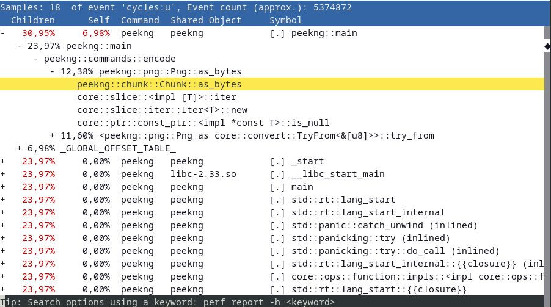

+++
title = "An introduction to performance analysis and understanding profilers"
date = "2022-06-14"
authors = ["kevin.kulot"]
tags = ["Teaching", "EPEA 2021", "Efficiency", "Profiling"]
+++

Where performance matters, we want to make sure we know what to look for and what to optimize.
For that we need to measure our code by analyzing its performance with tools either provided by the language or external ones called "profilers".
This post intends to give an overview on both of these methods while introducing some tools -- like `Google Benchmark` and `perf` -- and explaining their functionality.

<!--more-->

> "*Premature optimization is the root of all evil.*"

A famous quote by Tony Hoare, later popularised by Donald Knuth, shows why measuring performance is so important.
If we try to optimize our code before knowing *where* it may be needed, it might end up hindering us in the long run.
Trying to be unnecessarily clever by, for example, replacing divisions and multiplications by powers of two with bit shifts, might just end up hurting readability while not providing any gains in performance as most compilers nowadays are able to do such trivial optimizations.

We want to do **benchmarks**, more precisely **micro benchmarks**.
Micro benchmarks are for measuring small parts, like single functions or routines of our code, inspecting hot loops and investigate small things such as cache misses or assembly code generation.
Before we perform these micro benchmarks, let's introduce a dichotomy[^1] of tools.

**In-Code Benchmarking:** Measuring/performing benchmarks within the language by leveraging existing functions and libraries.

**Profilers:** External, language-agnostic tools which measure/perform benchmarks while utilizing the compiled binary and system calls.

## In-Code Benchmarking

Let's look at and compare three different languages and what they natively provide for benchmarking and measuring performance.
C, C++ and Rust -- compiled, systems programming languages -- all provide at least some tools necessary for capturing the current time (with varying precision), something we definitely need to begin measuring our code.
By going from an older, relatively low-level language[^2], like C, to a newer one like Rust with more high-level abstractions, we will quickly notice a difference in ease of use and amount of options available to us while coding (micro) benchmarks.

### As old as `<time.h>`: C and POSIX

Let's begin with C and its [`time.h`](https://en.cppreference.com/w/c/chrono) facilities:

```c {linenos=true,hl_lines=[5,7]}
#include <stdio.h>
#include <time.h>

int main(void) {
    time_t start = time(NULL);
    // expensive operation
    time_t end = time(NULL);

    printf("%.2f seconds\n", (double) end - start);

    return 0;
}
```

`time(...)` returns the current calendar time, which is almost always represented as the number of seconds since [the Epoch (00:00:00 UTC 01/01/1970)](https://en.wikipedia.org/wiki/Unix_time), as a `time_t` object.
The full function signature is `time_t time(time_t* arg)` where `arg` acts as an out-parameter storing the same information as the return value, which is why we pass in `NULL`.
Since `time_t` is just a typedef for an unspecified (implementation-defined) real type, we can compute the difference between `start` and `end` to get the elapsed time in seconds.
This essentially measures so-called "wall clock time", something we will come back to later.

One alternative time measuring facility is the `clock_t clock(void)` function.
Unlike `time()`, it returns the approximate processor time, or "CPU time", of the current process.
Similar to `time_t`, the returned value is also an implementation-defined real type[^3] from which we can calculate a difference.
This "CPU time" may differ from "wall clock time" as it may advance faster or slower depending on the resources allocated by the operating system.

If we want a little more precision while still using C, the C POSIX library offers additional functionality.
For example, [`gettimeofday()`](https://man7.org/linux/man-pages/man2/gettimeofday.2.html), provided by the `sys/time.h` header, lets us measure with microsecond accuracy:

```c {linenos=true,hl_lines=[8,10]}
#include <stdio.h>
#include <sys/time.h>

int main(void) {
    struct timeval tv_start;
    struct timeval tv_end;

    gettimeofday(&tv_start, NULL);
    // expensive operation
    gettimeofday(&tv_end, NULL);

    printf("%.2f µs\n", (double) tv_end.tv_usec - tv_start.tv_usec);
    return 0;
}
```

We declare two structs of type `timeval` as out-parameters for `gettimeofday()` which takes two arguments: `struct timeval* tv` and `struct timezone* tz`.
The `timeval` struct holds the following information:



```c
struct timeval {
    time_t      tv_sec;     /* seconds */
    suseconds_t tv_usec;    /* microseconds */
};
```

<--->

This allows us to also get the amount of microseconds after the Epoch for much greater measuring precision.
The type used to represent the microseconds, `suseconds_t`, is usually defined as a `long` which can hold at least 32 bits.



The second argument of `gettimeofday()` can be used to get information about the timezone of the system though it is obsolete and flawed, hence why just passing in `NULL` is recommended[^4].

### A new dawn: C++ and `<chrono>`

With the arrival of C++11, a more flexible collection of types for time tracking was added to the standard.
Including the most recent changes to [`<chrono>`](https://en.cppreference.com/w/cpp/chrono) as part of C++20, the following clock types are available:



**C++11**
- `std::chrono::system_clock`
- `std::chrono::steady_clock`
- `std::chrono::high_resolution_clock`

<--->

**C++20**
- `std::chrono::utc_clock`
- `std::chrono::tai_clock`
- `std::chrono::gps_clock`
- `std::chrono::file_clock`
- `std::chrono::local_t`



Now this might seem overwhelming at first but when it comes to benchmarking, the only clock types we need to look at are the ones added in C++11.
Out of these, `std::chrono::steady_clock` is the most suitable for measuring intervals.
To understand why, let's take a quick detour and talk about what a `Clock` is according to the C++ standard and the differences between the aforementioned three types of clocks.
In its most basic form, a clock type needs to have a starting point and a tick rate.
A more precise definition of the requirements needed to satisfy being a `Clock` type can be found [here](https://en.cppreference.com/w/cpp/named_req/Clock).

Now, let's compare the different clocks:

| `std::chrono::system_clock `    | `std::chrono::steady_clock `     | `std::chrono::high_resolution_clock `        |
|---------------------------------|----------------------------------|----------------------------------------------|
| - system wide *wall clock time* | - **monotonic** clock            | - clock with the smallest tick period        |
| - system time can be adjusted   | - tick frequency constant        | - alias of one of the other two              |
| - maps to C-style time          | - not related to wall clock time | - should be avoided (implementation-defined) |

**Wall clock time** is the actual, real time a physical clock (be it a watch or an actual wall clock) would measure.
A wall clock may be subject to unexpected changes which would invalidate any measurements taken with it.
It has the ability to jump backward or forward in time through manual adjustments or automatic synchronization with NTP (Network Time Protocol).
This makes `std::chrono::system_clock` biased and unfit for anything but giving us the current time.

**Monotonic clocks**, like `std::chrono::steady_clock`, on the other hand cannot jump forward or backward in time and their tick rate is constant.
`std::chrono::steady_clock` uses the system startup time as its Epoch and will never be adjusted.
It acts like a stopwatch, perfect for measuring intervals but not for telling time.

Let's look at an example:

```c++ {linenos=true,hl_lines=[8,10,12]}
#include <chrono>
#include <iostream>

// to save us from typing std::chrono everytime
using namespace std::chrono;

int main() {
    auto start = steady_clock::now();
    // expensive operation
    auto end = steady_clock::now();

    auto duration = duration_cast<milliseconds>(end - start).count();
    std::cout << duration << "ms\n";

    return EXIT_SUCCESS;
}
```

Just like before, we define a start and end time point with the `now()` function of the clock.
This static member function returns a `std::chrono::time_point` with the current time.
In line 12, we first compute the difference between these two, returning a `std::chrono::duration` type, which we can then cast to actual time units with `std::chrono::duration_cast()`.
The availabe units range from nanoseconds to years and are passed in as a template parameter.
Finally, `count()` converts the chosen time unit to the underlying arithmetic type which we can then output.

### A tale of abstractions: Rust et al.

Now that we know how C and C++ handle time, how clocks work and the differences between wall clock time and monotonic clocks, let's look at one final systems programming language with an even higher level of abstraction.
Unlike C++, Rust hides most of the implementation details (and spares us from typing `std::chrono` or verbose casts) while still providing the same level of precision:

```rust {linenos=true,hl_lines=[4,6]}
use std::time::Instant;

fn main() {
    let start = Instant::now();
    // expensive operation
    let end = start.elapsed();

    println!("{}ms", end.as_millis());
}
```

All that is needed, is to take the current time with `Instant::now()` as a start point, then define an end point.
An [`Instant`](https://doc.rust-lang.org/std/time/struct.Instant.html) type in Rust always represents a non-decreasing monotonic clock.
This end point could be -- just like in C or C++ -- defined as another `Instant::now()` and we could compute the difference but Rust also allows us to just call the `elapsed()` method on the start point.
This returns a [`Duration`](https://doc.rust-lang.org/std/time/struct.Duration.html) and is arguably more readable and declarative than a minus sign between two non-arithmetic types while also being shorter.

Finally, we can convert the `Duration` to time units with the corresponding methods similar to `duration_cast<>()` in C++.

### Going from measuring to benchmarking: Google Benchmark

So far, we only looked at what C, C++ and Rust offer us in terms of measuring time.
Of course, most languages offer similar features and functions though each with a slightly different syntax.
The goal is not to present all of these different ways of calling such functions -- that's what the docs are for -- but rather show different levels of abstractions while also highlighting similarities in the methodology.

Things like defining start and end points, computing their difference, being aware of clock types might be something to keep in mind regardless of the language used.
But what we did so far was not *benchmarking*.
In order for us to proclaim we performed a successful benchmark, we need to measure not only once but many more times.
We need to calculate the mean or median of these multiple measurements.
We want to rule out any random or statistical errors.
Ideally, we also want to not have to define start and end points manually like we did before for every single measurement.

This is where (micro) benchmarking libraries come in handy.
While many exist for every language, we are going to stick with C++ for now and take a look at [**Google Benchmark**](https://github.com/google/benchmark).
This open-source micro benchmarking library from Google makes timing of small code snippets much easier and allows us to get good statistical averages through repeated sampling of said snippets.

The example in their `README.md` shows the basic idea:

```c++ {linenos=true}
#include <benchmark/benchmark.h>

static void BM_StringCreation(benchmark::State& state) {
    for (auto _ : state) {
        std::string empty_string;
    }
}
// Register the function as a benchmark
BENCHMARK(BM_StringCreation);

static void BM_StringCopy(benchmark::State& state) {
    std::string x = "hello";
    for (auto _ : state) {
        std::string copy(x);
    }
}
// Register another function as a benchmark
BENCHMARK(BM_StringCopy);

BENCHMARK_MAIN();
```

Any method that we wish to benchmark has to be marked as `static`.
Furthermore, they also need to have a mutable reference to a `benchmark::State` as an argument.
By iterating over the state object with the code we wish to benchmark, we "add" to the sampling process.
The `BENCHMARK` macro registers the functions as a benchmark while the `BENCHMARK_MAIN()` macro generates an appropriate `main()` function.

If we compile the code as follows:

```
$ g++ main.cpp -std=c++11 -isystem benchmark/include -Lbenchmark/build/src -lbenchmark -lpthread -o main
```

We get this output:

```
2022-01-06T00:26:34+01:00
Running ./main
Run on (6 X 3696 MHz CPU s)
Load Average: 0.52, 0.58, 0.59
------------------------------------------------------------
Benchmark                  Time             CPU   Iterations
------------------------------------------------------------
BM_StringCreation       4.27 ns         4.33 ns    165925926
BM_StringCopy           7.84 ns         7.85 ns     89600000
```

Google Benchmark creates a table displaying wall clock time, CPU time and how often each function was sampled for us.
It is able to sample a function up to a billion times.
Now, to make this code faster, the first step would be to turn on optimizations.
Currently, we compile with no optimizations (`-O0`), so let's use `-O3` and see what happens:

```
2022-01-07T21:27:42+01:00
Running ./main
Run on (6 X 3696 MHz CPU s)
Load Average: 0.52, 0.58, 0.59
------------------------------------------------------------
Benchmark                  Time             CPU   Iterations
------------------------------------------------------------
BM_StringCreation      0.000 ns        0.000 ns   1000000000
BM_StringCopy           4.14 ns         4.17 ns    172307692
```

At first glance we seem to have created the world's fastest string creation function though sadly, that is not what happened.
Taking a look at line 5 of the example code reveals the problem.
`std::string empty_string` is declared but we do not use it anywhere else in the code, so the compiler is smart and sees that removing it would have no side effects to the program and does so.
Most of the time, this is the behavior we expect and want from our compiler but in this case we actually do want to keep this unused variable around.

Luckily, Google Benchmark has functions that can pretend to use a variable so the compiler can't just remove it anymore:

```c++ {linenos=true,hl_lines=[4]}
static void BM_StringCreation(benchmark::State& state) {
    for (auto _ : state) {
        std::string empty_string;
        benchmark::DoNotOptimize(empty_string);
    }
}
```

This allows us to still benchmark the creation of an empty string while using `-O3`.
There are many other ways to prevent certain optimizations from happening that would invalidate a benchmark though this and `benchmark::ClobberMemory()` are the ones Google Benchmark provides.[^5]
Now, our table looks much more sensible:

```
2022-01-07T21:26:18+01:00
Running ./main
Run on (6 X 3696 MHz CPU s)
Load Average: 0.52, 0.58, 0.59
------------------------------------------------------------
Benchmark                  Time             CPU   Iterations
------------------------------------------------------------
BM_StringCreation      0.681 ns        0.688 ns   1000000000
BM_StringCopy           4.04 ns         3.99 ns    172307692
```

Unwanted optimizations are just one thing to be aware of when doing benchmarks.
Depending on what is tested, we might want clear our cache before a run, do warmup runs if I/O is involved or compare the same function with differing parameters -- so called "parameterized benchmarks".
Many benchmarking libraries will have all of these advanced features and more but they are out of scope for this post.
For quick tests and comparisons, [**Quick Bench**](https://quick-bench.com/#), an online compiler using Google Benchmark, is a great alternative.

## Profilers -- more than just time

So far, we only measured the time it took for a program or a certain function to run.
Going back to the quote presented at the beginning: in order for us to optimize our code, we need to know *what* to optimize.
Just benchmarking some functions will not tell us where a potential bottleneck might be -- we need more information about our program.

This is where **profilers** shine brightest.
Profilers are usually external, language-agnostic tools that operate on a binary and not on source code.
They usually offer:

- (relative) timing of every function call
- generating call graphs (who called what) and flamegraphs
- frequency of instruction calls
- frequency of generated assembly function calls
- in-depth performance counter stats, e.g., branch misses, CPU cycles and many more

There are many different profilers out there, each specialized for their own use-case[^6] and it can help to know how to classify different types of profilers.
The most common types are:

- Flat profilers -- computes average call times
- Call-graph profilers -- shows call times, function frequencies and creates a call-chain graph
- Input-sensitive profilers -- generate profiles and charts based on different inputs and how a function scales based on it
- Event-based profilers -- only collect statistics when certain pre-defined events happen
- Statistical profilers -- operate via sampling by probing the call stack through interrupts

This classification is not mutually exclusive -- a profiler can offer any one or all of these features.
We are going to take a look at one tool in particular: `perf`.

### `perf`: jack of all trades

The reason why `perf` is a good first choice is that almost everyone (that uses Linux[^7]) already has it as it is part of the kernel.
It also does many of the aforementioned things just out of the box.
Let's start by creating a statistical profile:

```
$ perf stat ./peekng encode 123.png teSt secret
```

```
 Performance counter stats for './peekng encode 123.png teSt secret':

              2,54 msec task-clock:u              #    0,287 CPUs utilized
                 0      context-switches:u        #    0,000 /sec
                 0      cpu-migrations:u          #    0,000 /sec
               187      page-faults:u             #   73,490 K/sec
         4.724.914      cycles:u                  #    1,857 GHz
         5.977.214      instructions:u            #    1,27  insn per cycle
         1.103.539      branches:u                #  433,686 M/sec
            18.837      branch-misses:u           #    1,71% of all branches

       0,008852233 seconds time elapsed

       0,003009000 seconds user
       0,000000000 seconds sys
```

[`peekng`](https://github.com/xkevio/peekng) here just acts as an example program, all it does is encode the word `secret` into `123.png`.
As we can see, we received a lot of additional information about our program which may help with identifying optimization opportunities.
For example, we observe 187 page faults meaning `peekng` might have tried to access a memory page which was not loaded into RAM and had to be loaded from a disk 187 times (this is just one reason why a page fault might occur).
This may lead us to look at how we handle file reads and writes in our program.
Additionally, `perf stat` shows us the time it took to execute the program as wall clock time and CPU time (user + sys).

Another thing `perf` offers us, is creating an interactive call graph.
This happens with a combination of `perf record` and `perf report` though we need to be careful to not eliminate certain debug symbols.
Earlier, we looked at how we might want to prevent certain optimizations from happening while still using `-O3` (or your preferred language's equivalent) in source code -- now we need to fiddle with some compiler flags.

GCC, for example, has `-Og` as an additional optimization level which optimizes for debugging experience.
It enables some compiler passes for collecting debug information while only optimizing at a level close to `-O1`.
Having this additional information still in the binary will make reading and following the call graph much easier.
Another important thing is to keep the frame pointer register.
The frame pointer stores the current stack frame pointer in a reserved register if needed for a function.
It allows us to get additional information about how the stack was used during runtime.
By default, most compilers omit the frame pointer to get one additional register but this can be disabled via `-fno-omit-frame-pointer` in GCC.

Languages that do not use the GCC backend may have similar options though under different names.
Keeping the frame pointer under Rust, for example, actually requires us to modify the `perf record` command slightly.
Let's look at how it works:

```
$ perf record [-g / --call-graph=dwarf] <COMMAND>
[ perf record: Woken up 1 times to write data ]
[ perf record: Captured and wrote 0,135 MB perf.data (16 samples) ]
```

Usually, the `-g` flag will suffice to create the graph but to keep the frame pointer intact for languages like Rust, the second flag is required instead.
To generate the call graph from the `perf.data` file, `perf report [-g / -G]` is used.
Depending on if we want the function hierarchy to go from callee to caller or vice versa, either `-g` or `-G` is required.
The call graph, going from caller to callee, looks like this:

<center>
    
</center>

We can now see relative timings for every function call made, see which functions call other functions and get a more general idea of where a bottleneck might be.
Plus, `perf` also allows us to look at the assembly of a chosen function call by pressing the <kbd>A</kbd> key annotated with the frequency each instruction is called with.
Had we not done the previous steps of preventing certain optimizations and keeping debug symbols, this graph would be full of mangled function names and call hierarchies going deep into system calls.

`perf` provides many other options like setting tracepoints and even doing kernel microbenchmarks, which we aren't going to look at in this post, though it is certainly worth looking at what else it has to offer.

### The underlying kernel interface: `perf_events`

Since the profiler tool is part of the Linux kernel, it has mostly direct access to any events the kernel picks up on.
This is done via something called `perf_events` -- an interface exported by the Linux kernel.
It can measure events from different sources depending on the subcommand that was run.

**Software events** are pure kernel counters, utilized in part for `perf stat`.
They include such things as context-switches, page faults, etc.

**Hardware events** are events stemming from the processor itself and its PMU (Performance Monitoring Unit).
The PMU provides a list of michro-architectural events like CPU cycles, cache misses and some others.

**Tracepoint events**, implemented via the `ftrace` kernel infrastructure, provide a way to interface with certain syscalls when tracing is required.

For a full list of possible events, see the [perf wiki](https://perf.wiki.kernel.org/index.php/Tutorial).
The statistical profile we generated earlier came together through `perf` keeping a running count during execution of these supported events.
`perf_events` uses, as the name suggests, *event-based sampling*.
This means that every time a certain event happens, the sampling counter is increased.
Which event is chosen depends on how we intend to use `perf`.
The `record` subcommand, for example, uses something called the `cycles` event as its sampling event.
The kernel maps this event to a hardware event on the PMU which depends on the manufacturer of the processor.

Once the sampling counter overflows, a sample is recorded.
The instruction pointer then stores where the program was interrupted.
Unfortunately, the instruction pointer may not point at where the overflow happened but rather at where the PMU was interrupted, making it possible that the wrong instructions get counted.
This is why one always needs to be cautious when looking at graphs such as generated assembly annotated with the frequency of its execution as it might just be one or two instructions off.

[^1]: "A division or contrast between two things that are or are represented as being opposed or entirely different."
[^2]: https://queue.acm.org/detail.cfm?id=3212479
[^3]: Represented as clock ticks, not seconds -- convert via division by `CLOCKS_PER_SEC`
[^4]: https://man7.org/linux/man-pages/man2/gettimeofday.2.html#NOTES
[^5]: For more details on that, see this great talk: https://www.youtube.com/watch?v=nXaxk27zwlk
[^6]: See [here](http://pramodkumbhar.com/2017/04/summary-of-profiling-tools/) for a list of over a hundred different profilers and when to use which one
[^7]: `perf` is not available under Windows and also does not work with WSL (Windows Subsystem for Linux)
