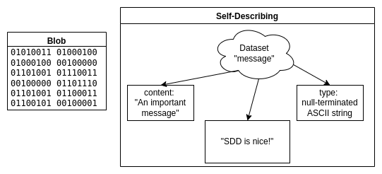
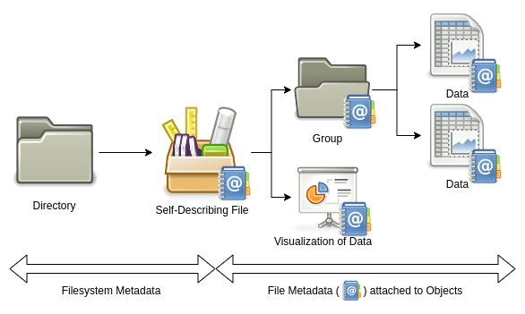
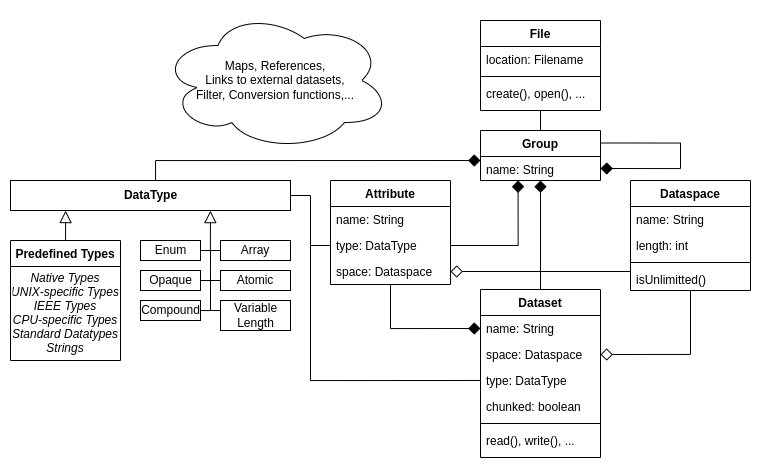
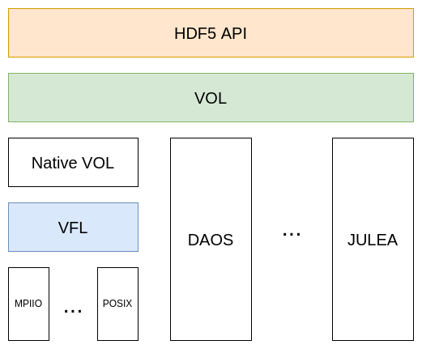

+++
title = "HDF5: Self-describing data in modern storage architectures"
date = "2022-08-02"
authors = ["timm.erxleben"]
tags = ["Teaching", "EPEA 2021", "Self-Describing Data Formats", "HDF5"]
+++

In today's post, we will discuss the advantages of self-describing data formats.
As a case study, we will examine the popular self-describing data format HDF5.
After a description of HDF5's basic features and its data model, we will follow the development of support for modern storage architectures through history.

<!--more-->

To understand the advantages of self-describing data formats, we first need to understand what self-describing data formats are.
Taking the [definition by Argonne National Laboratory](https://ops.aps.anl.gov/manuals/SDDStoolkit/SDDStoolkitse1.html), self-describing data formats have the following two properties:

1. The data is accessed by name and by class. Instead of reading 20 bytes starting at offset 1337, one would request to read the dataset named XYZ.
2. Various data attributes that may be necessary for interpretation are available. For example, data types, units, and file contents can be discovered by a user without prior knowledge.

The first point is only possible if the data format is paired with a programming library to access it.
Otherwise, users would need prior knowledge to parse the file's structure.
Another advantage is that the file format can be updated without dropping support for older applications because the data model is abstracted from the actual file.

## Why do we need self-describing data formats?

As explained above, abstracting the data model from files is beneficial for the maintainability of code.
Nevertheless, there is more to self-describing data.

The history of self-describing formats started in the 1980s[^cdf] as the amount of scientific data produced by simulations increased.
For global exchangeability of datasets, standards were needed to abstract from architecture-dependent data types and software-dependent storage layouts.
Take the following image as an example:



Imagine you receive the file on the left without information on how to interpret it.
You will have to invest some time until you realize that it contains an ASCII encoded string.
Understanding more complex data (especially some architecture-dependent float data types) would be practically impossible without further hints.

However, the file on the right side contains the data type of the file content and even a comment describing its content.
Using this information, it is easy to read the file's actual content, independent of the complexity of the data.
The ability to annotate data with units and comments further supports exchangeability.

Examples of self-describing formats for scientific data are HDF5 and NetCDF.
In this post, we will look at HDF5 as it is one of the most popular formats and, meanwhile, the base of NetCDF4.

## Basics of HDF5

HDF5 offers a complex and feature-rich data model.
Files can be understood as containers that can hold many different types of data.

Take a simulation experiment as an example.
During the experiment, a lot of data is created: a model describing the problem, a mesh discretizing the simulated space, initial and boundary conditions, the solver in use, parameters to the solver, the time series of the solution, and some visualizations of the result.
For reproducibility, you want to keep track of all the metadata describing how you obtained your results.
Those heterogeneous but logically related datasets may be stored in the same HDF5 file.
In doing so, the data and metadata are guaranteed not to be separated by accident.
Whoever receives a copy of this file will fully understand the details of your simulation and will be able to reproduce your results.



### So, how is data modeled in HDF5?

The most common objects in HDF5 files are groups, data types, dataspaces, datasets, and attributes.

**Groups** act like directories in file systems by mapping names to objects.
Nesting groups creates a hierarchical namespace in which objects are identified by a path.
The same object can be part of multiple groups, either via hard or soft links.
Therefore, care must be taken to not create loops that are not prevented by HDF5.
Every file has a root group denoted as `/`.
One could say that HDF5 creates a file system within a file.

In addition to built-in **data types**, e.g., floats and integers of different flavors, users may define their own complex data types.
Apart from creating arrays of a particular data type or packing up different data types into a compound, it is also possible to create atomic data types.
The definition of user-defined data types needs to be saved to the file so that it can be reread without prior knowledge.
This will happen automatically by using the data type resulting in an unnamed (i.e., *transient*) data type, but it is also possible to name the data type and save it to a group (i.e., saving it as a *committed* type).
Conversion functions can be registered and saved to the HDF5 file for user-defined atomic types.

In contrast to the POSIX data model, where a file is understood as a stream of bytes, elements contained in a dataset are addressed according to an associated **dataspace**.
The dataspace describes the number of dimensions and each dimension's size and maximum size.
If the size and maximum size are not equal, the dataset can grow in that dimension.
This is especially useful for time series, which might grow when more data is collected.
Growth may be unbound when the maximum size is set to infinity.
Unlike data types, dataspaces are always saved implicitly, i.e., they do not have a name.

**Datasets** hold the actual data in HDF5 files.
Their most important properties are the dataspace describing its shape and the data type of which its elements are.
Nevertheless, datasets have lots of settings and properties.
For example, the fill value for elements can be modified.
Reading from a new dataset, which was not yet written, will return the fill value.

Another vital setting controls if datasets are stored continuously or chunked.
If the dataspace contains a dimension that allows for growth, the dataset must be stored in chunks.
When more data is added, chunks can be appended without moving existing data.
The chunk size is set at the creation of the dataset.
While writing or reading, chunked data can be passed to a filter pipeline, transforming the data stream.
The most popular (and probably most useful) filter class is compression.
However, the user may define their own filter functions.

There is no limit to the size of datasets.
Nevertheless, it is neither practical nor possible to write or read several terabytes at once.
Fine-grained partial access is realized to solve that problem.
For every write and read, a selection of the dataset's dataspace needs to be passed.
This selection can be the original dataspace to access the whole set.
Basic selection types are point and hyperslab selections.
Point selections are created by supplying a list of coordinates that should be included.
Hyperslabs are regular patterns of arbitrary-sized blocks.
When dealing with large and dense matrices, hyperslabs can reflect the distribution of matrix parts to different clients.
Combining multiple selections using set operators provides an intuitive way to construct complex selections.

**Attributes** are metadata objects that may be attached to all named objects except other attributes.
They are similar to datasets as they are named objects (i.e., are referred to by a path) and have a dataspace and a data type.
However, there are some key differences:

- They do not support partial I/O, so they need to be written/read at once.
- They do not support chunked storage and are therefore of fixed size.
- They do not support compression.
- They are stored as part of the header of other objects inside the HDF5 file.

Attributes do not only explain the file's content to users but also enable visualization or search tools to interact with the data based on its meaning.
Several domain-specific conventions exist for this purpose.
One of the most popular sets of conventions are the [*Climate and Forecast (CF) Conventions*](http://cfconventions.org/cf-conventions/cf-conventions.html)[^cf].
If a file uses a specific set of conventions, it is automatically compatible with tools using the same conventions.

All relations between the objects explained above are summarized in the following diagram.
Please note that this is a simplified version to highlight the core concepts.



Only a short introduction to HDF5 features and concepts can be given in this post.
The nitty-gritty details of the concepts explained above, as well as additional features like maps and tables, are left for research to the curious user[^details].

## Programming with HDF5

Now that we know the basics of the HDF5 data model let us look at the practical usage of HDF5.

The library is shipped with C, C++, Fortran, and Java interfaces.
Apart from those, there are bindings for most popular programming languages, including Rust, Go, Python, Julia, and Matlab.
As most scientific software is written in C or Fortran, examples will be given in C.

The interface is grouped into several modules for a better overview:

- `H5A` - Attributes
- `H5D` - Datasets
- `H5S` - Dataspaces
- `H5T` - Data types
- `H5F` - Files
- `H5G` - Groups
- `H5P` - Property Lists
- etc.

The general workflow is similar for all objects in HDF5.
First, objects are created or opened, returning a unique handle for that object.
Using the handle, objects can be manipulated.
When everything is done, the object needs to be closed.
The handle will then be invalid.

Let us make a short example of how to write a dataset and some attributes:

First, we need to create a file and a group.

```c {linenos=true}
// create a file and a group
hid_t file_id = H5Fcreate("solution.h5", H5F_ACC_TRUNC, H5P_DEFAULT, H5P_DEFAULT);
hid_t group_id = H5Gcreate(file_id, "important_data", H5P_DEFAULT, H5P_DEFAULT, H5P_DEFAULT);
```

Though the code is mainly self-explanatory, you may have noticed some mysterious `H5P_DEFAULT` constants in the code.
Those are default property lists.
Property lists contain many parameters controlling fine operations details and are manipulated using the `H5P` module.
Most functions accept several property lists for different purposes.
`H5Fcreate`, for example, takes a file creation property list and a file access property list.
We will later see how the file access property list is used to access files via specific HDF5 plugins.
However, in most cases, the standard is sufficient.

After creating the file and a group, we should write some data.
Therefore we create a dataspace for a 3x3 matrix which will be used to store `important_numbers`.
Using our new dataspace we create the dataset named `my_cool_data` in the group created above.
The data type for the numbers on the disk will be the native float type of the machine.

Everything is set to actually write the matrix to the file.
As explained above, the dataspace is again given for partial I/O.
As we pass the original dataspace, the whole matrix will be written.

In addition, `H5Dwrite` retakes the data type and the dataspace.
You probably wonder why the type and space need to be passed twice.
The reason is that HDF5 can read a different data type from a different shape from memory than it may be written to disk.
Therefore, it would be possible to only take the main diagonal of a matrix in double precision from memory and write it to disk as a vector in single precision.

```c {linenos=true, linenostart=4}
// create and write to a dataset
float important_numbers[3][3] = {{42, 42, 42},
                                 {42, 42, 42},
                                 {42, 42, 42.42}};
hsize_t dims[2] = {3, 3};
hsize_t* max_dims = dims;

hid_t space_matrix_id = H5Screate_simple(2, dims, max_dims);

hid_t set_id = H5Dcreate(group_id, "my_cool_data", H5T_NATIVE_FLOAT, space_matrix_id,
    H5P_DEFAULT, H5P_DEFAULT, H5P_DEFAULT);

H5Dwrite(set_id, H5T_NATIVE_FLOAT, space_matrix_id, space_matrix_id,
    H5P_DEFAULT, &important_numbers);
```

The following code snippet shows how to add metadata in the form of attributes to the file.
Writing attributes is mostly similar to writing datasets.
Nevertheless, as no partial I/O is supported for attributes, the write function takes no selection of a dataspace.

It is also shown how to use strings in HDF5.
The built-in type `H5T_C_S1` is copied, and its size is modified because the standard only takes 1 character.
To get a variable-sized string, you can pass `H5T_VARIABLE`.

```c {linenos=true, linenostart=17}
// create some attributes
hid_t space_scalar_id = H5Screate(H5S_SCALAR);
float mean = 42.05;
char content_description[] = "Contains a dataset with the answer to everything!";

hid_t string_type = H5Tcopy(H5T_C_S1);
H5Tset_size(string_type, sizeof(content_description));

hid_t attr_group = H5Acreate(group_id, "content", string_type, space_scalar_id,
    H5P_DEFAULT, H5P_DEFAULT);

H5Awrite(attr_group, string_type, content_description);

hid_t attr_set = H5Acreate(set_id, "mean", H5T_NATIVE_FLOAT, space_scalar_id,
    H5P_DEFAULT, H5P_DEFAULT);

H5Awrite(attr_set, H5T_NATIVE_FLOAT, &mean);
```

At last, every opened object can be closed.

```c {linenos=true, linenostart=30}
// close all objects
H5Tclose(string_type);
H5Dclose(set_id);
H5Aclose(attr_group);
H5Aclose(attr_set);
H5Sclose(space_scalar_id);
H5Sclose(space_matrix_id);
H5Gclose(group_id);
H5Fclose(file_id);
```

Putting all those snippets together to a valid C program[^full_code] and executing it yields the file `solution.h5`.
Using `h5dump` we can verify that the file indeed contains our data and metadata:

```console
$ h5dump solution.h5
HDF5 "solution.h5" {
GROUP "/" {
   GROUP "important_data" {
      ATTRIBUTE "content" {
         DATATYPE  H5T_STRING {
            STRSIZE 50;
            STRPAD H5T_STR_NULLTERM;
            CSET H5T_CSET_ASCII;
            CTYPE H5T_C_S1;
         }
         DATASPACE  SCALAR
         DATA {
         (0): "Contains a dataset with the answer to everything!"
         }
      }
      DATASET "my_cool_data" {
         DATATYPE  H5T_IEEE_F32LE
         DATASPACE  SIMPLE { ( 3, 3 ) / ( 3, 3 ) }
         DATA {
         (0,0): 42, 42, 42,
         (1,0): 42, 42, 42,
         (2,0): 42, 42, 42.42
         }
         ATTRIBUTE "mean" {
            DATATYPE  H5T_IEEE_F32LE
            DATASPACE  SCALAR
            DATA {
            (0): 42.05
            }
         }
      }
   }
}
}
```

Examples for reads are omitted as they are conceptually similar to writes.
More examples of short HDF5 programs can be found [here](http://web.mit.edu/fwtools_v3.1.0/www/Intro/IntroExamples.html).

## Parallelism in HDF5

All we have seen so far is how to write data using a single process on a single client.
In the context of HPC, parallel access to HDF5 files is necessary.
Otherwise, the I/O performance would be limited by the throughput of a single process on a single client.
Multiple approaches exist for parallel access.

The most straightforward way is to write one HDF5 file per process and "stitch" them together using external links in a central file.
Even though this approach is older than HDF5, it is further supported with *Virtual Datasets* (VDS), added in release 1.10.
A VDS is an object which behaves similarly to a single dataset.
In reality, however, it is a mapping to other datasets that may be part of another file.

Nevertheless, using multiple files contradicts the idea of a single container with all necessary data.
For real parallel access to a single file *Parallel HDF5* (PHDF5) was added in version 1.0.1 using MPI-IO.
Files are accessed with PHDF5 by passing a modified file access property list containing a reference to an MPI communicator at open or create time:

```c
hid_t plist_id = H5Pcreate(H5P_FILE_ACCESS);
H5Pset_fapl_mpio(plist_id, comm, info);
H5Fopen("my_file.h5", H5F_ACC_RDWR, plist_id);
```

Reads and writes are performed using the regular functions and appropriate dataspace selections.
Care must be taken on which operations are *collective* (i.e., all processes must participate) or *independent*.
All modifications of the file's structural metadata, such as creating or linking objects, are always collective.
Reads and writes can either be collective or independent, which is controlled by the data transfer property list.
In most cases, collective I/O leads to higher throughput.

Despite its easy usage, it is hard to get good performance with PHDF5.
I/O on a parallel distributed file system alone is a complex task where throughput is influenced by many factors.
The introduction of additional I/O layers further complicates I/O tuning[^tuning].

## Virtual File Layer

For PHDF5, MPI-IO was added as an additional storage interface next to POSIX.
This gave rise to the idea of a plugin system for different storage backends.
Consequently, the structure of the HDF5 library was changed, and the *Virtual File Layer* (VFL) was introduced in version 1.4.
Instead of using POSIX or MPI-IO directly, all I/O calls are abstracted and passed to a *Virtual File Driver* (VFD).
The VFD, in turn, will map the linear address space of an HDF5 file to the address space of a storage backend.
VFDs are used by manipulating the file access property list and setting the respective driver, which must be registered beforehand.
For details on registering a VFD with the HDF5 library, please refer to HDF5's documentation.
HDF5 provides several pre-defined VFDs.
Some interesting examples are:

- `H5FD_CORE`: perform I/O to RAM
- `H5FD_SEC2`: default VFD using POSIX
- `H5FD_MPIIO`: parallel access via MPI-IO
- `HDF5_HDFS`: direct access to files in Hadoop Distributed File System
- `H5FD_ROS3`: direct read-only access to files stored in Amazon S3
- `H5FD_MULTI`: call different underlying VFDs depending on the address range accessed

In addition, users can implement their own VFD to support their specific storage needs.
Currently, work is done to enable the dynamic loading of plugins at runtime.

### Limits of VFDs

VFDs only abstract I/O calls (i.e., only handle byte streams) and are therefore unaware of the HDF5 data model.
Though decisions can be made based on address ranges (e.g., as in `H5FD_MULTI`), the file's structure can not be changed to leverage features of modern storage technologies.
In practice, this approach excludes storage types that could (more or less) directly map the data model like, for example, [DAOS](https://github.com/daos-stack/daos).

## New architecture and Virtual Object Layer

To address the limitation of the VFD, the *Virtual Object Layer* (VOL) was introduced in version 1.12.
It provides another interface for plugins to interact with HDF5.
Unlike the VFL, the VOL operates on the data model abstraction level and defines an interface for callbacks for the public HDF5 interface functions.

For the VOL's implementation, the library was yet again restructured.
The default VOL plugin implements the HDF5 file format specification and uses the VFL to interact with storage backends.
The following picture summarizes the layers used in the library, in addition to some example VOL plugins not included with HDF5.



There are multiple ways to use VOL plugins.
The easiest way is to set environment variables to dynamically load a plugin at the program start.
However, just like VFDs, they can be used via file access control lists.

Interesting new possibilities are enabled by VOL.
For example, plugins can be stacked to a VOL chain.
I/O behavior can be traced easily by using these passthrough connectors.
Another use case is to transform data while passing it through the chain.

Nevertheless, the most interesting use case of VOL is to map HDF5 files to modern storage backends in a more intuitive way.
Metadata, for example, might be separated and stored in a key-value store or database, while datasets might be stored in an object store.
This is the case for the two VOL plugins currently under development in the [JULEA storage framework](https://github.com/julea-io/julea).
The goal is to make use of the enhanced query capabilities of those backends to speed up the analysis of data.
Another example is given by the [DAOS VOL plugin](https://github.com/HDFGroup/vol-daos), where the data model is mapped to the modern object store DAOS, which is designed for use with persistent RAM and NVMe SSDs.

As of the current version 1.13, the VOL interface was changed based on the gained experiences.
It will remain unstable until version 1.14, which is yet to be released.

## Summary and conclusion

Self-describing data formats are essential standards for exchanging scientific data as they abstract technical details from the user and enable the annotation of data with important metadata such as units.
HDF5 offers a feature-rich data model based on groups, datasets, data types, and dataspaces.
We have seen how HDF5 changed to fulfill growing requirements on storage systems.
Based on the idea of exchangeable backends, the VFL was created.
Today the actual HDF5 file format is only one implementation of the HDF5 data model among many other variants due to the introduction of the Virtual Object Layer.
At this point, the classical files and file systems are challenged, and new ways to model and access scientific data have emerged.

Of course, only the basics of HDF5 could be covered in this post, and many details need to be left out.
Because the VFL and VOL APIs are currently under change, only their high-level concepts are featured.
If you would like to gain further insight and hands-on experience with VOL plugins, the [webinars](https://www.hdfgroup.org/category/webinar/) offered by the HDF Group might be something for you.

## Sources

All information is taken from the HDF5 documentation and the [HDF5 changelog](http://web.mit.edu/fwtools_v3.1.0/www/ADGuide/HISTORY.txt) if not stated otherwise.

The graphics were made using [draw.io](https://app.diagrams.net/) and the [Gnome desktop icons](https://commons.wikimedia.org/wiki/GNOME_Desktop_icons) which are licensed under the [GPLv2](https://opensource.org/licenses/gpl-2.0.php).

[^cdf]: Development of [CDF](https://en.wikipedia.org/wiki/Common_Data_Format) started 1985.
[^cf]: Technically speaking, those conventions apply to the NetCDF self-describing data format. However, the naming of attributes can be transferred to HDF5 as done in the [Recommendations by NASA for Earth Science](https://earthdata.nasa.gov/esdis/eso/standards-and-references/dataset-interoperability-recommendations-for-earth-science).
[^details]: A good starting point is the [HDF5 documentation](https://docs.hdfgroup.org/hdf5/v1_12/_r_m.html).
[^full_code]: The full code of the HDF5 example can be found [here](hdf5-example.c).
[^tuning]: Further information on I/O tuning can be found in the [HDF5 documentation](https://confluence.hdfgroup.org/display/HDF5/Parallel+HDF5).
