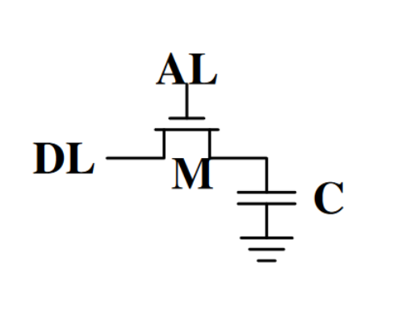
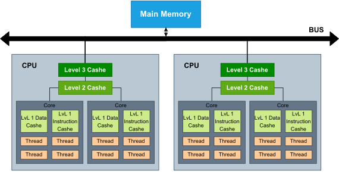
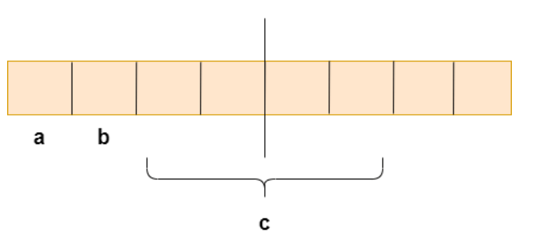
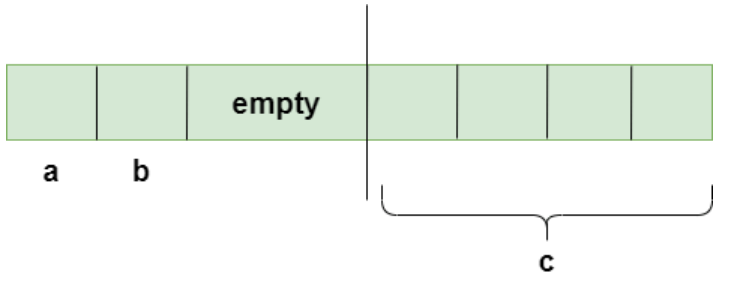

+++
title = "Memory Optimization"
date = "2023-02-27"
authors = ["janik.teune"]
tags = ["C", "Memory", "Efficiency", "Cashing", "EPEA 2022", "Teaching"]
+++

In this post we will talk about memory optimization.
We will discuss why optimizing memory is important 
and we will see some examples on how to use memory efficiently.

<!--more-->

## Motivation
Using your memory efficiently is obviously a good idea.
However, there is more to it, than most people think.

When you look at how performance has increased in the last couple of years,
you will notice that in opposition to other things, the performance of main memory has barely increased at all.
The latency of your main memory could not even be halfed since 1993.

To encounter that problem cashes were developed and now you have multiple of them in your PC,
one faster and closer to your CPU than another.

Problem is, your cashe can only contain a very limited amount of data. 
Every time your CPU has to get information from your main memory, 
you waste a lot of time loading that data into your registers and cashes.

Just a small comparison:
- Main memory --> needs about 100ns to load your data
- lvl3 cashe --> about 10ns, thats already just a tenth
- lvl2 cashe --> about 5ns
- lvl1 cashe --> about 1ns

Using your memory efficiently and hence, using your cashes effectively will grant you a great performance-boost.

## Cashes
Cashe is SRAM - Static Random Access Memory. 
It has multiple advantages to your main memory (which is DRAM - Direct Random Access Memory).
SRAM is much faster in comparison to DRAM and does not need to be recharged. 
(The Data on your DRAM will be lost, if it is not recharged regularly.)
The Problem is that SRAM is much more complex than DRAM. 
While a memory cell of DRAM needs only one transistor, 
Static RAM needs six transistors per memory cell.
Hence, SRAM is more expensive and not as compact as your main memory.

<!DOCTYPE html><html>
<head></head>
<body>
	
	
</body>
</html>

### Cashe structure
Most PCs have three levels of cashe. 
To avoid von Neumann Bottleneck the first cashe is separated into a Level 1 instruction-cashe and a Level 1 data-cashe.
Each CPU-core has its own Level 1 cashes, hence, cores do not share any memory in the Level 1 cashe.

Next to it is the Level 2 cashe.
It can store more data than the Level 1 cashe, but takes longer to access.
All Cores of one CPU can share memory in the Level 2 cashe, 
but each CPU has its own Level 2 cashe so CPUs cannot use shared memory in the Level 2 cashes.

The same goes for the Level 3 cashe. Cores can share memory there, but CPUs cannot.
The Level 3 cashe is again bigger, but slower than the Level 2 cashe.

If multiple CPUs want to share memory or if the Level 3 cashe is not sufficient,
they need to use the main memory.

<!DOCTYPE html><html>
<head></head>
<body>
	
</body>
</html>

### Cashe Access
When a CPU wants to load new data, it looks into the cashes first.
Therefore, it computes a Tag, from the Address of that data.
All data inside the cashe can be found with their Tag.
If the data is not found in any of the cashes, the CPU will load it from the main memory.
Doing so, the CPU will not only load one word at a time.
Instead, it will load one casheline at a time.
A casheline is a line of 8 consecutive words (that means 64 byte). 
The idea is that the Programm might need the surrounding data next, so the CPU can use the cashe for the upcomming tasks.

## Programming efficiently
Knowing how the cashe works, 
we can start thinking about improving the performance of our programs,
by effectively using the cashe.
Therefore, the first step is to decrease the memory that we use,
so more data can fit into the cashes.

### Padding
The first thing that might lead to used memory that we do not actually need is padding.
Padding is necessary because your CPU can only process one word at a time. 
Data has to be aligned on words or else the CPU will spend time on reading multiple words to process a single date.
To ensure that your data is aligned some memory cells will be left out, which is called padding.
 
Look at the images below:  
The left one shows two chars (__a__ and __b__) and an integer __c__ unaligned, so the CPU needs 2 cycles to read __c__.
 
<!DOCTYPE html><html>
<head></head>
<body>
	
	
</body>
</html>

