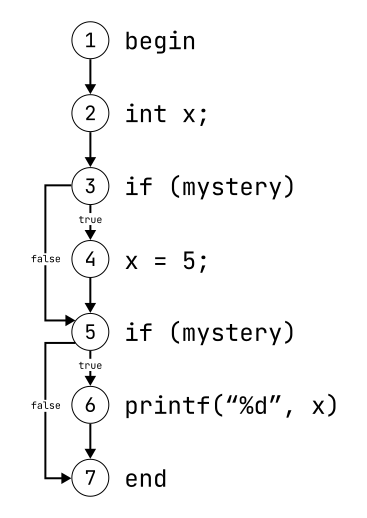

+++
title = "Static Analysis - Theory and Application"
date = "2024-04-01"
authors = ["marvin.zein"]
tags = ["Teaching", "EPEA 2023", "Static Analysis", "Correctness"]
+++

How can we detect possible runtime errors without running our code? In this post, we will look at what static analysis is, how it works, its applications, its strengths and its weaknesses.

<!--more-->

## What is static analysis

> Static program analysis is the art of reasoning about the behavior of computer programs without actually running them. [^spa-moller]

This quote, taken from the ["Static Program Analysis" lecture notes](https://cs.au.dk/~amoeller/spa/) by Anders Møller and Michael I. Schwartzbach, nicely sums up what static analysis is about: Answering questions about the runtime behaviour of programs without running them. This is in contrast to dynamically testing a program, where we actually run a program to check if it behaves according to its intended behaviour. We as humans can statically analyse code as well by reading our code and imagining what it will do at runtime. But we are more interested in an automated solution. There are 3 main applications of static analysis found in programs: [^wiki-static-analysis] [^spa-moller]

1. Analysis for program **optimisation**
2. Analysis for program **development**
3. Analysis for program **correctness**

The first two, optimisation and development, will not be the focus of this post. But to give some examples, optimisation techniques are usually implemented by compilers and entail processes like finding dead code (code that never runs) or loop unrolling. Analysis for development is done by IDEs. Examples for analysis for development are automatic code refactoring (restructuring code without changing its behaviour) or type hints. All of these examples require the code to be analysed statically. The main focus of this article will be on analysis for program correctness. [^spa-moller]

## Correctness

What does it mean for a program to be correct? Simply put: A program is correct if it behaves as specified. This also entails that it does not crash, does not delete data it is not supposed to, and generally does not produce undefined behaviour. Static analysis can help us by finding bugs in our code in an early production stage. The types of programs that implement static analysis for correctness are called **static analysis tools**. [^heidelberg-korrektheit]

Now lets look at the theoretical side of static analysis and what is possible by thinking of questions about a program we want to reason about. We could ask us:

- Are there any null pointer dereferences?
- Do we divide by 0?
- Are there any memory leaks?
- Are all variables initialized before being accessed?
- Are SQL injections possible?
- If we use parallel programming, could our code lead to data races?
- Do we use interfaces correctly (For example, do we always call `hasNext()` before `next()` when using iterators in Java)? [^spa-moller]

We want these questions to be answered automatically by a static analysis tool. Now what would the ideal tool do?

- It would not miss any errors
- It would not sound false alarms (if it reports an error, it really is an error)
- It would always terminate [^pliss-moller]

There is just one problem: As [Rice's theorem](https://en.wikipedia.org/wiki/Rice%27s_theorem) states, all non-trivial semantic properties of programs are undecidable. Since our questions are questions about non-trivial semantic properties of a program, they are undecidable. This means that there will never be the ideal static analysis tool that can answer us these questions while always being correct, never sounding false alarms and always terminating. Therefore, we need an approximate solution. [^pliss-moller] [^wiki-unentscheidbar]

First, a realistic static analysis tool can miss errors. These are so-called **false negatives**. Second, a static analysis tool can sound false alarms. Such false warnings are called **false positives**. Third, a static analysis tool should still always terminate. Which developer would want to use a tool that sometimes does not terminate? [^pliss-moller] [^wiki-unentscheidbar]

## How static analysis tools work, using ESLint as an example

Now that we have an understanding about static analysis and static analysis tools, let us look at how static analysis tools work. We are going to use ESLint as an example.

ESLint is a static analysis tool for JavaScript. It can help us find errors in our code early and can even fix some of them automatically. It is open source, fully customisable, and most popular editors and IDEs offer editor integration for inline error messages. These editor integrations are especially useful, as they give you immediate feedback by showing yellow or red squiggly lines under the parts of your code where ESLint has found an error while you are typing. Alternatively, you can run ESLint using a terminal and pass it the file(s) you want to analyse. The _ES_ in ESLint stands for [ECMAScript](https://en.wikipedia.org/wiki/ECMAScript), the JavaScript standard. _Lint_ stands for [linter](<https://en.wikipedia.org/wiki/Lint_(software)>), which is another term for static analysis tool. [^eslint-docs]

As with all static analysis tools, ESLint analyses the code using a set of rules. The core set of rules encompasses around 200 rules, part of them generic and applicable to most languages, and part of them JavaScript specific. These core rules can be extended with custom rules. There are several community-maintained custom rule sets, like checks for security related issues or rules for TypeScript, a superset language of JavaScript. [^eslint-docs] [^eslint-community]

To understand what rules look like and how rules work, let us look at an example: the `no-dupe-else-if` rule, which is part of the core rules. Like the name suggests, this rule checks whether we are using redundant `else-if` statements in our code. [^eslint-no-dupe-else-if]

```js
if (a) {
  foo();
} else if (b) {
  bar();
} else if (b) {
  baz();
}
```

As you can see, we are checking the same condition twice so that `baz()` is unreachable. This was most certainly not intended by the developer. If we were to run ESLint, we would get an error message with the name of the rule and the line of code where the error occurred.

Now let us look at how ESLint works internally. Let us do this by using a different example. Take the following code:

```js
for (let i = 0; i < 10; i++) {
  console.log(i);
}
```

The first thing ESLint does is to parse the code and generate an abstract syntax tree (AST). The AST represents the structure of the program. Each node represents a construct in the code. This enables ESLint to analyse the code by traversing the AST. However, the AST does not contain information about the order of execution. It merely is a representation of the code structure. A simplified version of the AST for our code example looks like this: [^eslint-architecture]

<figure style="display: block; margin: auto; text-align: center">
  
  <figcaption style="padding: 8px 0">Simplified AST of the example program</figcaption>
</figure>

`Program` is the root node and encompasses our whole program. Next we have the `ForStatement` node. This node consists of four nodes, representing the parts of a for-loop:

- `init`: The part before the first semicolon (`let i = 0`). It is of type `VariableDeclaration` in our example, because we have declared the control variable `i`.
- `test`: The part after the first semicolon (`i < 0`). It marks the loop's condition.
- `update`: The part after the second semicolon (`i++`). It is of type UpdateExpression because `i` is incremented.
- `body`: What's inside the for statement

After generating the AST, ESLint traverses it. At each node, an event with the same name as the node is emitted. This event also contains the specific node the traversal is currently at. Now every rule that handles this type of event is executed. The results of the execution will be reported back afterwards. The best way to show how this works is to define our own rule. [^eslint-architecture]

In JavaScript, it is possible to declare two or more control variables inside the `init` part of a for-loop like this:

```js
for (let i = 0, j = 10; i < j; i++) {
  console.log(i);
}
```

Have a look at the AST again. The `init` part of a for-loop contains another node called `declarations`, which is an array of `VariableDeclarators`. Each entry in that array describes one control variable declaration. Now, let's say we want to make a new rule that gives us a warning when there is more than one variable declaration inside the `init` part of a for-loop. We could do this by giving a warning if the length of the `declarations` array is bigger than 1. Let's call this rule `single-control-variable`. We could implement the rule like this:

```js
module.exports = {
  meta: {
    type: "problem",
    docs: {
      description:
        "Enforce that only a single control variable may be initialized inside the init-part of for-loops.",
    },
    schema: [],
  },
  create(context) {
    return {
      ForStatement(node) {
        if (
          node.init &&
          node.init.type == "VariableDeclaration" &&
          node.init.declarations.length > 1
        ) {
          context.report({
            node: node.init,
            message:
              "More than one control variable declared inside init-part of for-loop.",
            data: {
              variables: node.init.declarations,
            },
          });
        }
      },
    };
  },
};
```

The rule contains some metadata, but the important part is inside the `return` statement of the `create(context)` function. Now, when we run ESLint, it traverses the AST and emits a ForStatement event. The `ForStatement()` function gets called with the corresponding node in the AST as an argument. Now, we check three things:

- `node.init`: Does this for-loop have an init part (it could be empty in JavaScript) AND...
- `node.init.type == "VariableDeclaration`: Do we declare variables? AND...
- `node.init.declarations.length > 1` Are there more than 1 control variables being declared?

If the three conditions above evaluate to true, a warning with the message `More than one control variable declared inside init-part of for-loop` will be reported, including the corresponding line number in our code. [^eslint-architecture]

## What causes false positives

As previously mentioned, it is possible for static analysis tools to report errors when there are no actual errors. In this chapter, I want to show you how false positives can come about using data flow analysis as an example.

Data flow analysis is a technique for "gathering information about the possible set of values calculated at various points in a computer program" [^wiki-data-flow-analysis]. Data flow analysis can be used, among other things, to check that all the variables we use are initialized before they are accessed. Accessing uninitialized variables would lead to undefined behaviour. Let us look at an example in C. [^spa-moller]

```c
#include <stdio.h>
void main() {
  int x;
  printf ("%d", x);
}
```

The `main()` function would lead to undefined behaviour, as we are printing an uninitialized variable.

For data flow analysis, we need a different data structure called a control flow graph (CFG). A CFG is a directed graph, with every node being a code statement. The edges represent the order of execution. Therefore, CFGs are flow sensitive, unlike ASTs, which are flow insensitive. The CFG for our code example looks like this: [^wiki-cfg]

<figure style="margin: auto; display: block; text-align: center;">
  
  <figcaption style="padding: 8px 0">Simple CFG (Based on image from <a href="#fn:12"><sup>12</sup></a>, page 222, License: unknown)</figcaption>
</figure>

The CFG has two special nodes, `begin` and `end`, which mark the start and end of the program and also the start and end of the analysis. The static analysis tool now traverses the graph from beginning to end. As it traverses the graph, it keeps track of the initialization state of a variable. A variable can have four states, resembled by this lattice: [^getting-started] [^spa-moller]

```
      unknown
      /     \
     /       \
   init    not init
     \       /
      \     /
        both
```

- `unknown`: We don't know anything about the variable at that point in time, as it has not appeared in our code
- `init`: The variable has been initialized
- `not init`: The variable has only been declared but not initialized
- `both`: At this point in time, the variable could be either initialized or not, depending on which execution path the program has taken before. [^getting-started]

The most confusing state is probably the `both` state, which I will explain later in another example. For now, ignore it. Let us first perform the data flow analysis for our example. The numbers represent each node.

1. `x` is unknown since it has not appeared in our code yet
2. `x` is declared but not initialized
3. the `printf()` function accesses `x`. Since `x` is not initialized, the static analysis tool gives a warning

So far, so good. The tool behaves correctly. Now, let's try to change our code to get a false positive. For that, we need a more complex CFG. Real code usually contains conditional branching or loops. Have a look at these CFGs:

<figure style="margin: auto; display: block; text-align: center;">
  
  <figcaption style="padding: 8px 0">Left: if-else-statement; Right: while-loop (Based on image from <a href="#fn:11"><sup>11</sup></a>, License: CC License)</figcaption>
</figure>

If you look at the if-else-statement CFG, you can see that node 1 has two outgoing edges. One is taken if the condition is true, the other if it is false. You can also see that the paths merge back into node 4. This prevents the analysis from becoming too complex. If the paths would not get merged, we would have to analyse every possible path the program could take individually, which would lead to exponential time complexity. But this merging is also the weak point that can lead to false positives. Look at this example: [^getting-started]

```c
#include <stdio.h>
void maybePrintFive(int mystery) {
  int x;
  if (mystery) {
    x = 5;
  }
  if (mystery) {
    printf("%d", x);
  }
}
```

This simple function takes an integer. If the integer is not 0, we print 5. Otherwise, the function does not output anything or change anything. The code is written badly on purpose to show the creation of a false positive, but it works correctly nonetheless. The corresponding CFG looks like this:

<figure style="margin: auto; display: block; text-align: center;">
  
  <figcaption style="padding: 8px 0">CFG for false positive example (Based (but content edited) on image from <a href="#fn:12"><sup>12</sup></a>, page 223, License: unknown)</figcaption>
</figure>

Now, let's traverse the CFG to track the values of the variables. We now have two variables to track, `x` and `mystery`.

1. `mystery` is unknown, `x` is unknown
2. `mystery` is unknown, `x` is uninitialized
3. `mystery` is unknown, `x` is uninitialized

Since our data flow analysis does not actually know the value of `mystery` and whether it evaluates to true or false, both paths are taken. First, let's check the path for true:

4. `mystery` is unknown, `x` is initialized

If we take the false path, no code will be executed. Now, at node 5, both paths are merged back again into one. This is where we get uncertainty. If the path for true is taken, `x` is initialized. If the false path is taken, `x` is uninitialized. `x` is now in a kind of superposition, and our static analysis marks `x` as `both`.

5. `mystery` is unknown, `x` is both

Now, for the next if-statement, we again have to check both paths.

6. At node 6, `printf()` accesses `x`. Since `x` is now `both`, the static analysis tool issues a warning. The message could look like this: "Error: Possible use of uninitialized variable"

This is a false positive. If we look at our code, it is impossible for the `printf()` function to be executed if `x` is not initialized. Nevertheless, because of this approximate analysis, it is marked as an error.

## Strengths and weaknesses

To recap, let's have a look at the strengths and weaknesses of static analysis tools:

### Strengths

Static analysis tools help us catch errors early in the development process. The later an error is found in the development process, the costlier it is. With static analysis, we can find bugs as we write our code. Static analysis tools are especially good at finding well known bugs or vulnerabilities. Second, static analysis is really easy to implement. Static analysis tools exist for every major programming language. All you have to do is install and run it. No need to define test cases. A third advantage of static code analysis is that we can enforce a consistent coding style in a project. This is especially advantageous when multiple developers work on the same project, which is usually the case. [^owasp-tools] 

### Weaknesses

Two main weaknesses are false negatives and false positives. The bigger issue of the two may actually be false positives. It can get annoying really quickly if your tool regularly reports errors that are not actually errors. This can lead to developers completely ignoring the output of the static analysis tool. Also, false positives obscure warnings for actual bugs. Another weakness of static analysis is that it has no idea of the developer's intent. While it is great to catch common errors, it can't check whether your program actually does what you want it to. Dynamic testing can't do that either, but at least you can define special test cases to check whether the program behaves correctly for these cases and abstract from that. So as my final remark, to best ensure that your program is correct, use both static analysis and dynamic testing. It can save you a lot of time, effort and money. [^getting-started] [^owasp-tools]  [^harness-static-dynamic]

# Sources

[^spa-moller]: Anders Møller and Michael I. Schwartzbach, "Static Program Analysis". Accessed 20.11.2023. Available [here](https://cs.au.dk/~amoeller/spa/spa.pdf)
[^wiki-static-analysis]: Wikipedia: Static Program Analysis. Accessed 09.12.2023. Available [here](https://en.wikipedia.org/wiki/Static_program_analysis)
[^heidelberg-korrektheit]: Prof. Dr. Ullrich Köthe, University of Heidelberg, Lecture: "Algorithmen und Datenstrukturen". Accessed 30.11.2023. Available [here](https://alda.iwr.uni-heidelberg.de/index.php/Korrektheit)
[^pliss-moller]: Anders Møller, "Static Program Analysis (part 1/2) - Anders Møller - PLISS 2019“, Programming Language Implementation Summer School 2019. 22.05.2019. Available [here](https://www.youtube.com/watch?v=Lr4cMmaJHrg)
[^wiki-unentscheidbar]: Wikipedia: Rice's Theorem. Accessed 04.12.2023. Available [here](https://en.wikipedia.org/wiki/Rice%27s_theorem)
[^eslint-docs]: ESLint Docs. Accessed 04.12.2023. Available [here](https://eslint.org/docs/latest/)
[^eslint-community]: ESLint-community github. Accessed 04.12.2023. Available [here](https://github.com/eslint-community)
[^eslint-no-dupe-else-if]: ESLint no-dupe-else-if rule. Accessed 10.12.2023. Available [here](https://eslint.org/docs/latest/rules/no-dupe-else-if)
[^eslint-architecture]: ESLint architecture. Accessed 10.12.2023. Available [here](https://eslint.org/docs/latest/contribute/architecture/)
[^getting-started]: Bruno Cardoso Lopes and Rafael Auler, _Getting Started with LLVM Core Libraries_, volume 1. Birmingham, UK: Packt Publishing Ltd, 2014.
[^wiki-cfg]: Wikipedia: Control flow graph. Accessed 10.12.2023. Available [here](https://en.wikipedia.org/wiki/Control-flow_graph)
[^owasp-tools]: OWASP: Source Code Analysis Tools. Accessed 10.12.2023. Available [here](https://owasp.org/www-community/Source_Code_Analysis_Tools)
[^harness-static-dynamic]: Harness.io blog. Accessed 10.12.2023. Available [here](https://www.harness.io/blog/static-vs-dynamic-code-analysis)
[^wiki-data-flow-analysis]: Wikipedia: Data-flow-analysis. Accessed 18.02.2023. Available [here](https://en.wikipedia.org/wiki/Data-flow_analysis)